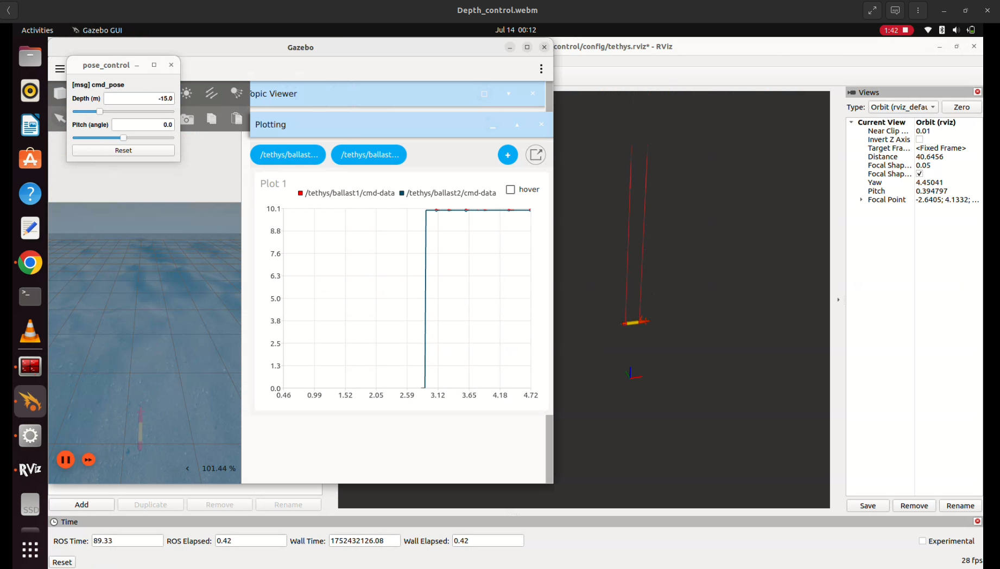

# Variable Buoyancy System (VBS) Simulation for AUV in ROS2 Humble

This simulation package was developed as part of my **Summer Fellowship 2025** at the **Indian Institute of Technology Madras (IITM), India**.

## 🧭 Overview

This repository contains a ROS 2-based simulation for a **Variable Buoyancy System (VBS)** implemented on a medium-sized Autonomous Underwater Vehicle (AUV). The simulation studies how dual spherical VBS tanks affect the **heave** (vertical) and **pitch** motion of the AUV.

A modified **Tethys AUV model** is used for realistic underwater behavior and control demonstrations.

---

## 🖼️ Simulation Images

<p align="center">
  
  <br>
  <em>Figure: Ignition Gazebo simulation of Tethys AUV with dual VBS tanks</em>
</p>

---

## ✅ Features

- Dual spherical VBS tanks for vertical and angular control
- Depth and pitch regulation using PID controllers
- Simulation using Ignition Gazebo Fortress (v6.17.0)
- Built with ROS 2 Humble middleware
- Modular and scalable ROS 2 package structure
- Real-time visualization in RViz2 and Ignition GUI
- Includes demonstration videos

---

## 🧰 Technology Stacks Used

- **ROS 2**: Humble Hawksbill
- **Simulation**: Ignition Gazebo Fortress (v6.17.0)
- **Languages**: Python, C++
- **Visualization**: RViz2, Ignition GUI

---

## 📁 Package Structure

```
vbs_ws/src/
├── auv_control                # PID and control modules
├── pose_to_tf                # Pose transformation utilities
├── simple_launch             # Example and helper launch files
├── slider_publisher          # Interactive slider-based command publisher
├── thruster_manager          # Thruster configuration and management
└── vbs_tethys
    ├── vbs_control           # VBS-specific control nodes and launch files
    └── vbs_description       # AUV URDF, meshes, plugins, and worlds
```

---

## 💻 Installation and Setup

### ✅ Prerequisites

- Ubuntu 22.04
- [ROS 2 Humble](https://docs.ros.org/en/humble/Installation.html)
- Ignition Gazebo Fortress (v6.17.0)
- Eigen3 library

### 🔧 Installation Steps

```bash
# Create workspace
mkdir -p ~/vbs_ws/src
cd ~/vbs_ws/src

# Clone repository
git clone https://github.com/Abinesh-Thankaraj/Variable_Buoyancy_System_ROS2.git .

# Install dependencies
sudo apt-get install ros-humble-gazebo-ros-pkgs \
                     ros-humble-control-toolbox \
                     ros-humble-robot-localization

# Build packages
cd ~/vbs_ws
rosdep install --from-paths src --ignore-src -r -y
colcon build --symlink-install
source install/setup.bash
```

---

## 🚀 Launching the Simulation

### 1. Basic World Launch  
Spawns the AUV in an underwater Gazebo world:
```bash
ros2 launch vbs_description world_launch.py
```

### 2. VBS Mass Control Interface  
Interactively control ballast tank mass (simulates water added/removed):
```bash
ros2 launch vbs_description upload_vbs_launch.py sliders:=true
```

### 3. Full Depth & Pitch Control  
Run cascaded controller with RViz and pose GUI:
```bash
ros2 launch vbs_control sliding_mode_launch.py
```
This launches:
- Real-time VBS control
- Depth/pitch pose adjustment interface
- RViz2 visualization

---

## 🎥 Demonstration Videos

Located in the `Demonstration_video/` folder:

- `Depth_control.webm`
- `Pitch_control.webm`

---


## 🙏 Acknowledgements

This simulation was created during the **Summer Fellowship 2025** under the mentorship and guidance of **Prof. Rajiv Sharma** from the Department of Ocean Engineering, **Indian Institute of Technology Madras (IITM)**.
